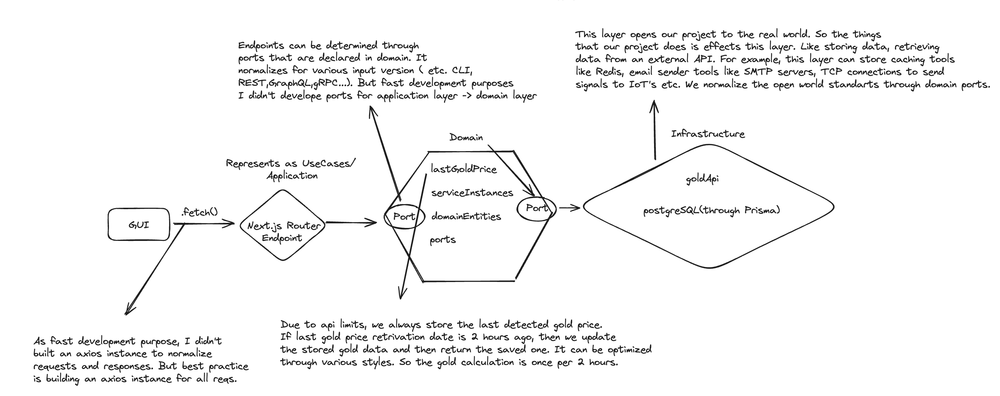
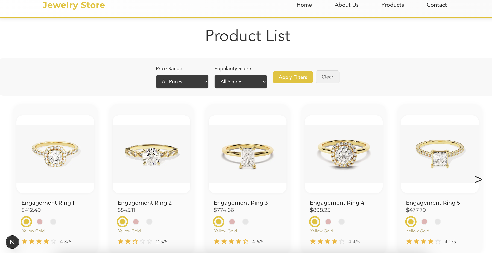
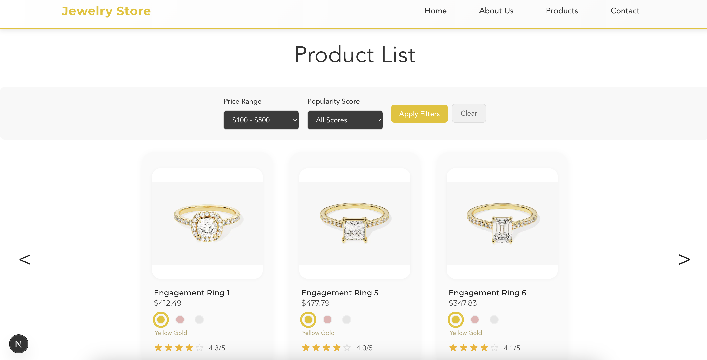

This is a [Next.js](https://nextjs.org) project bootstrapped with [`create-next-app`](https://nextjs.org/docs/app/api-reference/cli/create-next-app).

## Introduction

This is the repository of solution of Renart Full Stack Development Internship/Case Study. Altought I am intrested in backend development with Java Spring Boot, I built an app with Next.js/Prisma for fast development (all in once). The program contains all the features given in the instructions.

This is the basic scheme of the project.

## Getting Started
- Use npm i to install necessary packages.
- Create .env file in the root of the project.
- Configure .env file according to these fields:
    DATABASE_URL=
    GOLD_API_BASE_URL=https://www.goldapi.io/api
    GOLD_API_ACCESS_TOKEN=
    ! We use GoldAPI.io. You can get your token from the website and fill out.
- Use "docker compose up" in the root directory from the terminal.
- Use "npx prisma generate" to generate a new prisma client.
- If you want to load sample data, use "npx tsx seed.ts" in the "/scripts" directory.
- Use "npm run dev" to start the project.

##View

This is the main page view which contains the products. You can move to left and right to view the next or last package of 5 products.

This is the view of when you use filtering in the project.